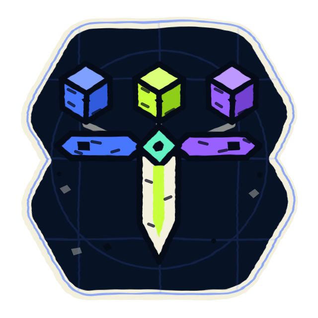

<p align="center">
  
</p>

<h1 align="center">dagger</h1>

<p align="center">
  Reusable Dagger modules for personal infrastructure.
</p>

## Status

The repository is being redone on current Dagger, starting from the modules that
live in [langri-sha.com](https://github.com/langri-sha/langri-sha.com) today.
Nothing is published here yet.

The previous TypeScript modules — `hermes`, `hermes-workspace`, `letta-code`,
`paperclip`, `tailscale` and `tigerfs` — are on the
[`legacy`](https://github.com/langri-sha/dagger/tree/legacy) branch.

## Working on the repository

Projen manages the repository root.

```sh
pnpm install
pnpm projen   # re-synthesize root config after editing .projenrc.ts
pnpm format   # prettier --write .
```
